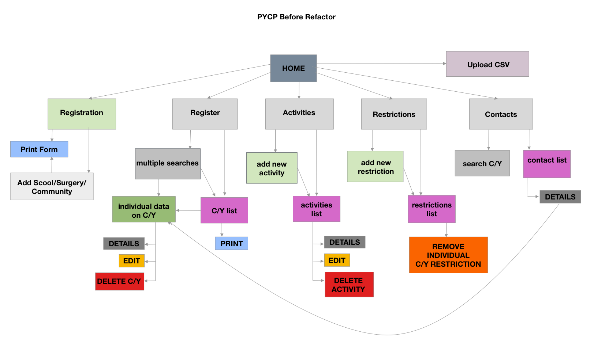
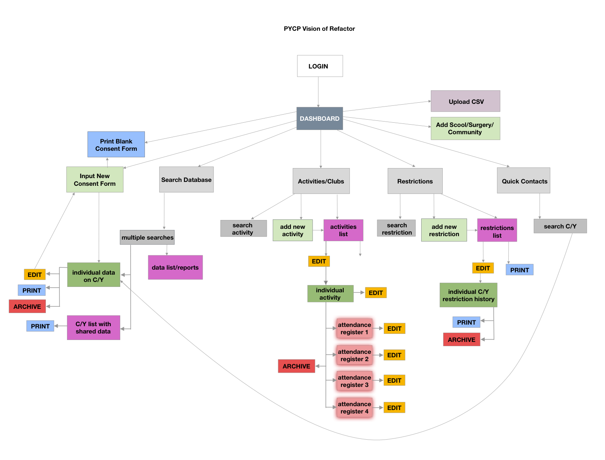

# Edinburgh Youth Project App
  > ### Client Experience

### UX Designer & Product Owner

I am currently undertaking a group charity project for Pilton Youth and Children's Project. We formed as a group of 3 as an UX Design Team. This project was initially started from scratch by a cohort of CodeClan in October 2019. Since then there have been a series of 2 week sprints iterating over the codebase in order to complete the brief for the Client. 

As the first UX team to take on the project, we quickly identified that we needed to take a step sideways and evaluate the project as a whole.

#### User Journey Map

#### Vision of refactor

### Colour Palette

